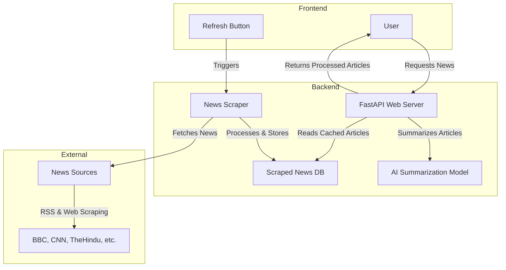
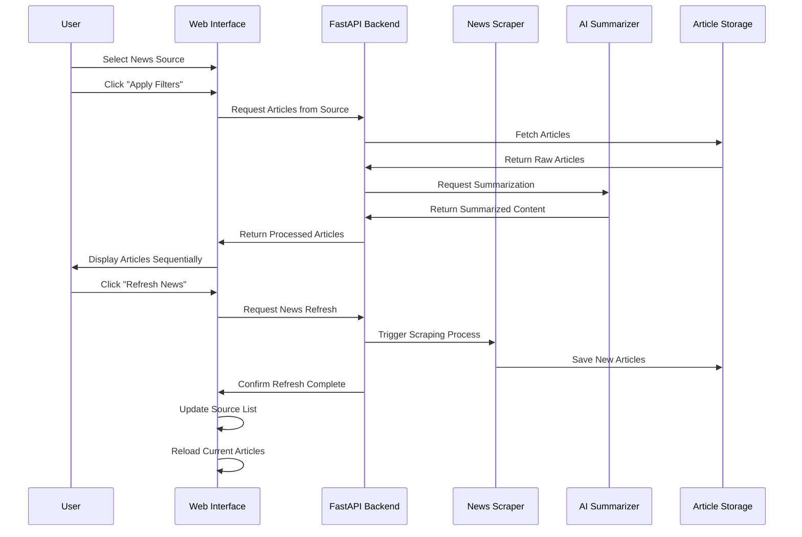

# Newsense - AI-Powered News Aggregator and Summarizer

Newsense is an intelligent news aggregation and summarization platform that uses AI to scrape, process, and present news from various sources. The application provides a clean, user-friendly interface for browsing summarized news articles with advanced filtering capabilities.

## 🌟 Features

- **Intelligent News Scraping**: Automatically scrapes news from multiple sources (BBC, CNN, The Hindu, etc.)
- **AI-Powered Summarization**: Uses transformer models to generate concise summaries of news articles
- **Clean Two-Column Layout**:
  - 30% width sidebar for source filtering
  - 70% width main section for news display
- **Dynamic Content Loading**: Articles load sequentially for a smooth user experience
- **Real-time News Refresh**: One-click news refresh button to fetch the latest articles
- **Category Tagging**: Automatic categorization of news articles
- **Responsive Design**: Works on desktop and mobile devices

## 📊 System Architecture



## 🔄 Process Flow



## 🚀 Setup & Installation

### Prerequisites

- Python 3.8+
- pip (Python package manager)
- Virtual environment (recommended)

### Installation Steps

1. **Clone the repository**

```bash
git clone https://github.com/vikassahu1/Newsense.git
cd Newsense
```

2. **Create and activate virtual environment**

```bash
# Windows
python -m venv venv
venv\Scripts\activate

# macOS/Linux
python3 -m venv venv
source venv/bin/activate
```

3. **Install dependencies**

```bash
pip install -r requirements.txt
```

4. **Download NLTK data (required for summarization)**

```bash
python download_nltk_data.py
```

5. **Run the news scraper to fetch initial articles**

```bash
python run_scraper.py
```

6. **Start the FastAPI server**

```bash
python -m app.main
# Or use uvicorn directly
# uvicorn app.main:app --reload
```

7. **Access the web interface**

Open your browser and navigate to: http://localhost:8000

## 🧰 Project Structure

```
newsense/
├── app/                       # FastAPI Web Application
│   ├── static/                # Static assets
│   │   ├── css/               # CSS stylesheets
│   │   ├── js/                # JavaScript files
│   │   └── images/            # Image assets
│   ├── templates/             # Jinja2 HTML templates
│   │   └── index.html         # Main application template
│   ├── __init__.py            # Package initialization
│   └── main.py                # FastAPI application & routes
├── scrapper/                  # News scraping functionality
│   ├── __init__.py            # Package initialization
│   ├── main.py                # News scraper implementation
│   └── scraped_news/          # Scraped articles storage
│       ├── BBC/               # Organized by source
│       ├── CNN/
│       ├── TheHindu/
│       └── ...
├── summarizer.py              # AI summarization module
├── download_nltk_data.py      # NLTK data downloader
├── run_scraper.py             # Script to run the news scraper
├── run_newsense.py            # Combined runner script
├── requirements.txt           # Python dependencies
└── README.md                  # Project documentation
```

## 🖥️ Usage

### Browsing News

1. Select a news source from the left sidebar
2. Click "Apply Filters" to load articles
3. Browse through the news cards in the main section
4. Click article titles or "Read More" to view full articles

### Refreshing News

Click the "Refresh News" button in the top-right corner to fetch the latest articles from all sources. This will:

1. Run the news scraper to fetch fresh content
2. Update the source list with any new sources
3. Reload the currently selected source (if any)

## 🧠 AI Summarization

Newsense uses transformer-based models to generate concise summaries of news articles. The system:

1. Extracts the main content from each article
2. Processes the content through a summarization model
3. Generates a readable summary highlighting key information
4. Presents the summary along with metadata (author, date, category)

## 👨‍💻 Contributing

Contributions are welcome! Please feel free to submit a Pull Request.

1. Fork the repository
2. Create your feature branch (`git checkout -b feature/AmazingFeature`)
3. Commit your changes (`git commit -m 'Add some AmazingFeature'`)
4. Push to the branch (`git push origin feature/AmazingFeature`)
5. Open a Pull Request

## 📝 License

This project is licensed under the MIT License - see the LICENSE file for details.

## 🙏 Acknowledgments

- News sources providing RSS feeds and content
- Hugging Face for transformer models
- FastAPI for the web framework
- The open-source community for various libraries and tools 
